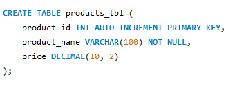
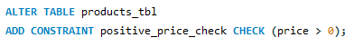
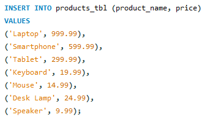
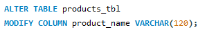
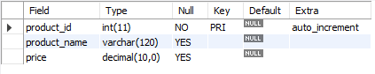
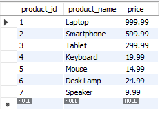
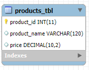

# Finals Lab Task 3. Data Manipulation
In this task, a database and table were set up to manage product details, with rules to ensure that prices are always positive. The structure of the table was designed to store product names and prices, and the length of the product name field was increased to allow for longer entries. This method helps keep the data organized and ensures consistency through built-in constraints.  

These are the necessary steps for the the main task:  
  
1. Create a table named products with the following fields:

 - id: Unique Integer, auto-increment, primary key.

 - product name: String (VARCHAR) with a maximum length of 100, cannot be null.

 - price: Decimal
  
2. Add a CHECK constraint to ensure that the price of the product must be greater than 0.
  
3. Insert the products that will not violate the check constraint into the products table:

 - Product 1: "Laptop", 999.99

 - Product 2: "Headphones", -49.99

 - Product 3: "Smartphone", 599.99

 - Product 4: "Tablet", 299.99

 - Product 5: "Monitor", -149.99

 - Product 6: "Keyboard", 19.99

 - Product 7: "Mouse", 14.99

 - Product B: "Desk Lamp", 24.99

 - Product 9: "External Hard Drive", -79.99

 - Product 10: "Speakers", 9.99

4. Modify the product name field to have a maximum length of 120 characters.

## Query Statements:

- **Step 1:** Creating a Table.  
   
- **Step 2:** Adding Constraints.  
   
- **Step 3:** Inserting the values.  
  
- **Step 4:** Modifying the product name.  
  

## Table Structures:
**1. Product Table:** (From Step 1 and 2)  
    
**2. With Inserted Values and Modified Table:** (From Step 3 and 4)  
  

## Entity Relationship Schema:
* Attached image of the schema below:

  

